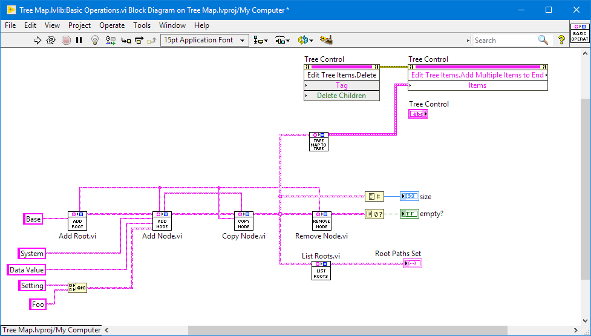
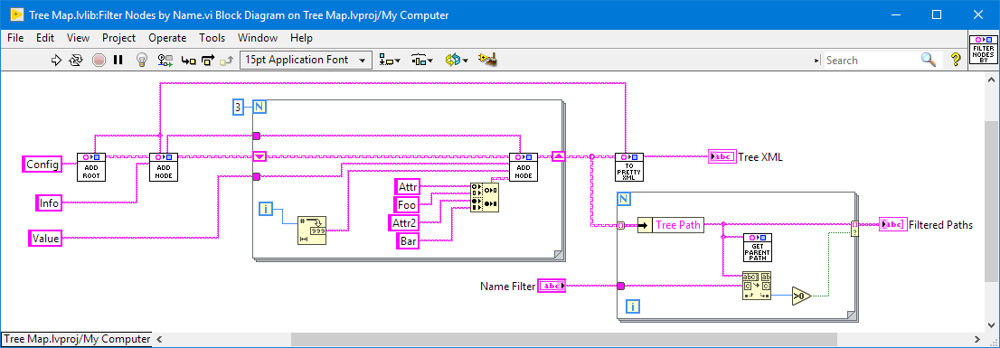
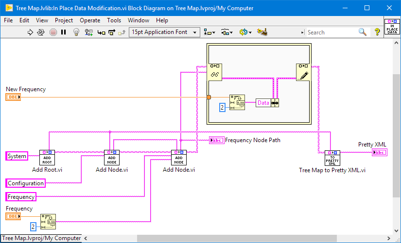
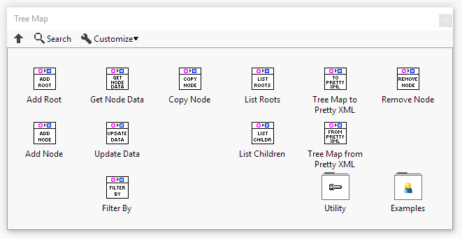
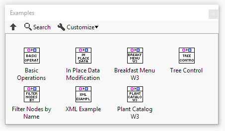

# Tree Map API
LabVIEW implementation of Tree data structure, based on base maps.

This package is intended to use the inbuilt LV19 Set and Map data types to provide a Tree Map data type. It includes basic functions and helpers to interact with the new Tree Map type.

In computer science, a tree is a widely used abstract data type (ADT)—or data structure implementing this ADT—that simulates a hierarchical tree structure, with a root value and subtrees of children with a parent node, represented as a set of linked nodes.

https://en.wikipedia.org/wiki/Tree_(data_structure)

This package is a little more open, simpler and more native than the previously available Tree API. It should be considered for all new designs.

